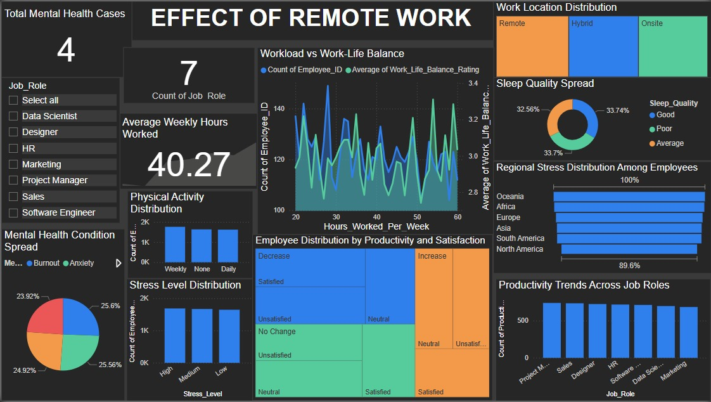

# WorkSphere

This interactive Power BI dashboard visualizes the impact of remote work on employees' mental health, productivity, stress levels, and lifestyle choices across different job roles and regions.

---

## 📌 Project Overview

Remote work has reshaped how organizations operate and how employees manage their work-life balance. This dashboard analyzes multiple aspects of remote work and its implications on:

- Mental health conditions (Burnout, Anxiety)
- Stress and productivity levels
- Sleep and physical activity patterns
- Workload and job satisfaction
- Work location preferences and their impact

---

## 🚀 Features

- **Total Mental Health Cases** tracker
- **Workload vs. Work-Life Balance** correlation analysis
- **Job Role-based Filtering**
- **Work Location Distribution** (Remote, Hybrid, Onsite)
- **Mental Health Condition Spread** (Burnout, Anxiety)
- **Sleep Quality & Physical Activity Analysis**
- **Regional Stress Distribution**
- **Stress Level Distribution**
- **Employee Productivity & Satisfaction Breakdown**
- **Job Role-based Productivity Trends**

---

## 🛠 Tech Stack

- **Power BI**: Data visualization and dashboard creation
- **CSV/Excel**: Source data inputs

---

## 🗂 Dataset Overview

Columns used (example structure):
- `Job_Role`
- `Work_Location`
- `Hours_Worked_Per_Week`
- `Work_Life_Balance_Rating`
- `Mental_Health_Condition`
- `Stress_Level`
- `Sleep_Quality`
- `Physical_Activity`
- `Region`
- `Productivity_Change`
- `Satisfaction_Level`

---

## 🧑‍💻 How to Use

1. **Download the `.pbix` file** (Power BI Desktop file).
2. Open with **Microsoft Power BI Desktop**.
3. Connect to your dataset (if not embedded).
4. Interact with slicers and visuals to explore:
   - Filter by job roles
   - View trends by location and role
   - Examine stress, mental health, and productivity patterns

---

## 📈 Key Insights (Sample)

- Average weekly hours worked: ~40 hours
- Most employees experience **moderate to high stress** regardless of physical activity
- Hybrid work models show slightly better sleep quality
- Mental health concerns like burnout and anxiety are evenly spread across job roles

---

## 📃 License

This project is for educational and analytical purposes. For commercial use, please contact the author.
